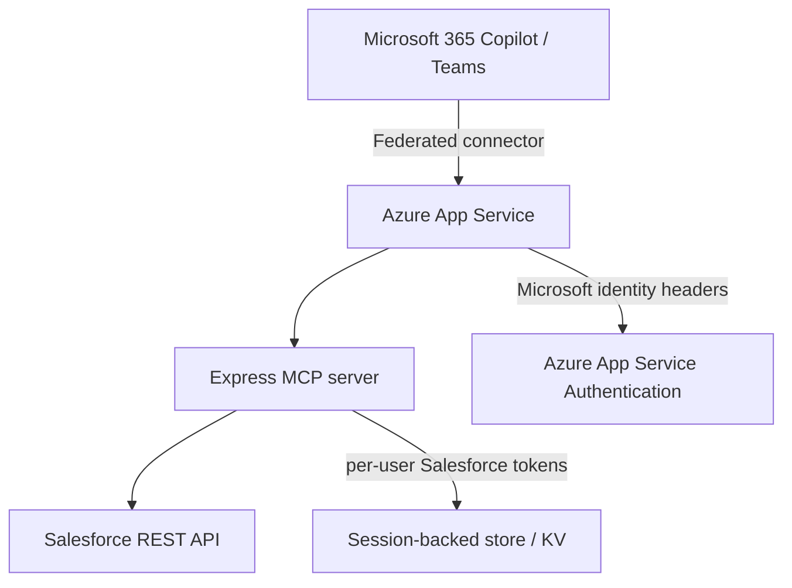

# Salesforce Copilot Connector Overview

## 1. Architecture diagram

Runtime path:
- Copilot/Teams sends requests to the federated connector endpoint.
- Azure App Service authenticates the Microsoft user and forwards identity headers.
- The MCP server validates Microsoft identity, then runs Salesforce-backed tools.
- Salesforce REST APIs are called using the signed-in user's stored access token.

## 2. Authentication flow

1. The user signs in to Microsoft 365 Copilot / Teams.
2. Azure App Service Authentication validates the Microsoft identity and injects principal headers.
3. The connector reads the Microsoft principal from request headers.
4. The user visits `/auth/salesforce/start` to begin Salesforce OAuth.
5. The server starts Salesforce Authorization Code + PKCE flow using `SF_CLIENT_ID` and `SF_CLIENT_SECRET` if provided.
6. Salesforce redirects back to `/auth/salesforce/callback` with the authorization code.
7. The connector exchanges the code for `access_token` and `refresh_token`.
8. Salesforce tokens are stored per Microsoft user session.
9. MCP requests to `/mcp` are allowed only when both Microsoft identity and Salesforce session are present.

## 3. Salesforce Connected App configuration

Required settings:
- Callback / Redirect URI:
  - `https://<your-app>/auth/salesforce/callback`
- OAuth scopes:
  - `api`
  - `refresh_token`
  - `offline_access`

Salesforce app credentials:
- `SF_CLIENT_ID` — Connected App consumer key
- `SF_CLIENT_SECRET` — Connected App consumer secret (if required)

Notes:
- Use a Web App / API Connected App configuration.
- Ensure the callback URL exactly matches the deployed public URL.
- If the Connected App uses refresh tokens, Salesforce user sessions can persist across token refresh cycles.

## 4. Azure deployment steps

1. Deploy the app to Azure App Service.
2. Enable Azure App Service Authentication with Microsoft Entra ID.
3. Set App Service application settings:
   - `SF_LOGIN_URL`
   - `SF_API_VERSION`
   - `SF_CLIENT_ID`
   - `SF_CLIENT_SECRET` (if required)
   - `EXTERNAL_BASE_URL`
4. Optionally set local testing values only for development:
   - `DEV_BYPASS_USER_ID`
   - `DEV_BYPASS_USER_NAME`
   - `DEV_BYPASS_TENANT_ID`
5. Install dependencies and build:
   - `npm install`
   - `npm run build`
6. Start the app and confirm it listens on the configured `PORT`.
7. Confirm the public URL and `EXTERNAL_BASE_URL` match.

## 5. Copilot connector registration steps

1. Register or configure your Microsoft 365 Copilot / Teams federated connector.
2. Use the MCP endpoint:
   - `https://<your-app>/mcp`
3. Confirm the connector can reach the app and that App Service Authentication is enabled.
4. Verify the connector by checking:
   - `https://<your-app>/health`
   - `https://<your-app>/auth/status`
5. Connect Salesforce for each signed-in Microsoft user:
   - `https://<your-app>/auth/salesforce/start`

### Useful endpoints

- `GET /health` — service health check
- `GET /auth/status` — Microsoft auth + Salesforce connection status
- `GET /auth/salesforce/start` — begin Salesforce sign-in
- `GET /auth/salesforce/callback` — Salesforce OAuth callback
- `POST /mcp` — MCP request endpoint
